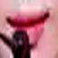

# Introduction
main.py를 실행하면 dataset에 있는 영상에서 입만 인식되어 result폴더에 저장된다.

# Dlib-lip-detection
Developed by [Davis King](https://github.com/davisking)

[기술 사용]
* Facial landmark detection
* Correlation tracking
* Deep metric learning

Facial landmark detection feature 를 이용하여 입 이미지를 얼굴 이미지로부터 crop하는 것에 Dlib-lip-detection을 사용할 것이다.

# Installation
시작하기 전에, 아래의 설치 과정을 거쳐야 한다.

~~~shell
$ pip install numpy
$ pip install cv2
$ pip install cmake dlib
~~~

# Detecting Lips on given image
## Facial landmarks on dlib

다음 사진과 같이, 얼굴에서 68개의 점을 찍어 detect 한다.

이 중, 우리는 입만 crop할 것이다.
    landmark number [49,68].

## Detecting facial landmarks
### Preparing for detection

수정 가능한 변수 :

~~~python
# Some constants
RESULT_PATH = './result/'       # The path that the result images will be saved
VIDEO_PATH = './dataset/'       # Dataset path
LOG_PATH = 'log.txt'            # The path for the working log file
LIP_MARGIN = 0.3                # Marginal rate for lip-only image.
RESIZE = (64,64)                # Final image size
logfile = open(LOG_PATH,'w')
# Face detector and landmark detector
face_detector = dlib.get_frontal_face_detector()   
landmark_detector = dlib.shape_predictor("shape_predictor_68_face_landmarks.dat")	# Landmark detector path
~~~

위 변수를 조정하여 사용자가 원하는 대로 경로, 사이즈 등을 조정할 수 있다.

## 실행 결과 

